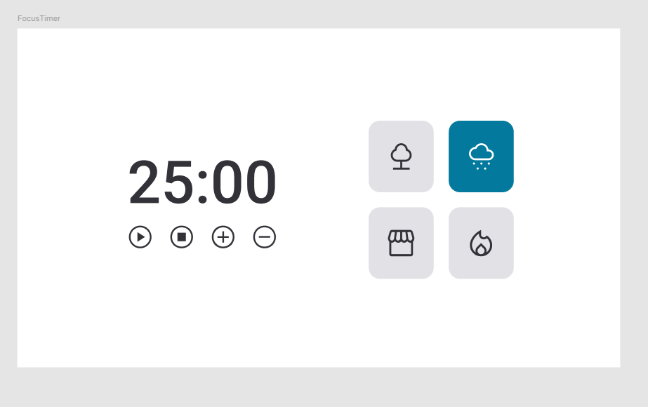

<h1 align="center"> Focus Timer(V2) </h1>

  <a href="#-tecnologias">Tecnologias</a>&nbsp;&nbsp;&nbsp;|&nbsp;&nbsp;&nbsp;
  <a href="#-projeto">Projeto</a>&nbsp;&nbsp;&nbsp;|&nbsp;&nbsp;&nbsp;
   <a href="#-layout">Layout</a>&nbsp;&nbsp;&nbsp;|&nbsp;&nbsp;&nbsp;
  <a href="#-layout">Documentação Lógica</a>&nbsp;&nbsp;&nbsp;

 

## 🚀 Tecnologias

Esse projeto foi desenvolvido com as seguintes tecnologias:

- HTML
- CSS
- JavaScript
- Figma

## 💻 Projeto

Neste desafio foi criado um Focus Timer(V2) parecido com o Pomodoro. Temas aplicados:

- Funções no Javascript
- Manipulação da DOM
- Funções
- Callback Functions
- ESModules
- Clean Code
- States
- Adicionando áudios
- Responsividade
  
## 📝 Proposta

  

## ✅ Resultado
[Acesse o resultado finalizado do Focus Timer(V2), online](https://devbonatto.github.io/FocusTimerV2/)

## 🔖 Layout
Você pode visualizar o layout do projeto através [DESSE LINK](https://www.figma.com/file/mWWxLYCbpmM3rMqWB7lKV8/Stage-05-Focus-Timer-2.0-Copy?fuid=1369823793362288511)

## 📄 Documentação Lógica
[CLIQUE AQUI](https://drive.google.com/file/d/1Wb5G5eejA0y8PA7HosY_djrcIQGnY3Xg/view?usp=sharing) para ver a documentação lógica do projeto.
